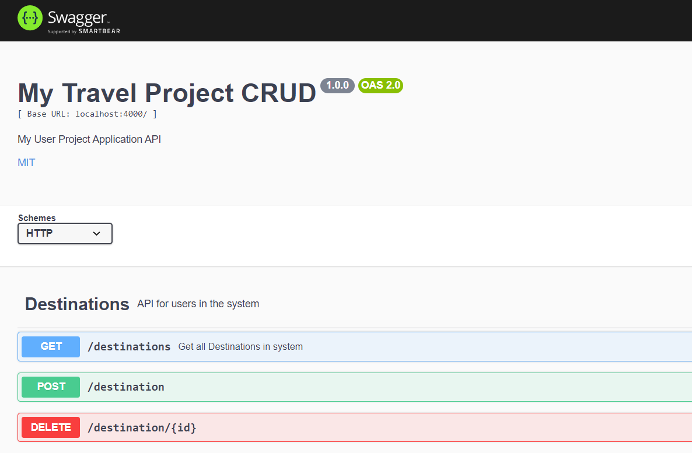

# Travel-Project-CRUD
## Travel Project CRUD

Through the use of Swagger, this travel exercise allows the user to Create, Read, and Delete travel destinations to a database and see what has been done.  
To run this on your machine, download the files and follow these steps: 
1. Open a terminal window. Type npm install swagger-jsdoc swagger-ui-express express nodemon 
2. Type npm install -g nodemon 
3. Type nodemon index.js 
4. Go to localhost:4000/api-docs and run the desired CRUD functionality.
  
Additional functionality that would be helpful to a user for future iterations would be to include even more different types of CRUD functionalities.  
MIT License  
Copyright (c) 2023 Yvette Watson  
Permission is hereby granted, free of charge, to any person obtaining a copy of this software and associated documentation files (the "Software"), to deal in the Software without restriction, including without limitation the rights to use, copy, modify, merge, publish, distribute, sublicense, and/or sell copies of the Software, and to permit persons to whom the Software is furnished to do so, subject to the following conditions:
The above copyright notice and this permission notice shall be included in all copies or substantial portions of the Software.  
THE SOFTWARE IS PROVIDED "AS IS", WITHOUT WARRANTY OF ANY KIND, EXPRESS OR IMPLIED, INCLUDING BUT NOT LIMITED TO THE WARRANTIES OF MERCHANTABILITY, FITNESS FOR A PARTICULAR PURPOSE AND NONINFRINGEMENT. IN NO EVENT SHALL THE AUTHORS OR COPYRIGHT HOLDERS BE LIABLE FOR ANY CLAIM, DAMAGES OR OTHER LIABILITY, WHETHER IN AN ACTION OF CONTRACT, TORT OR OTHERWISE, ARISING FROM, OUT OF OR IN CONNECTION WITH THE SOFTWARE OR THE USE OR OTHER DEALINGS IN THE SOFTWARE.
